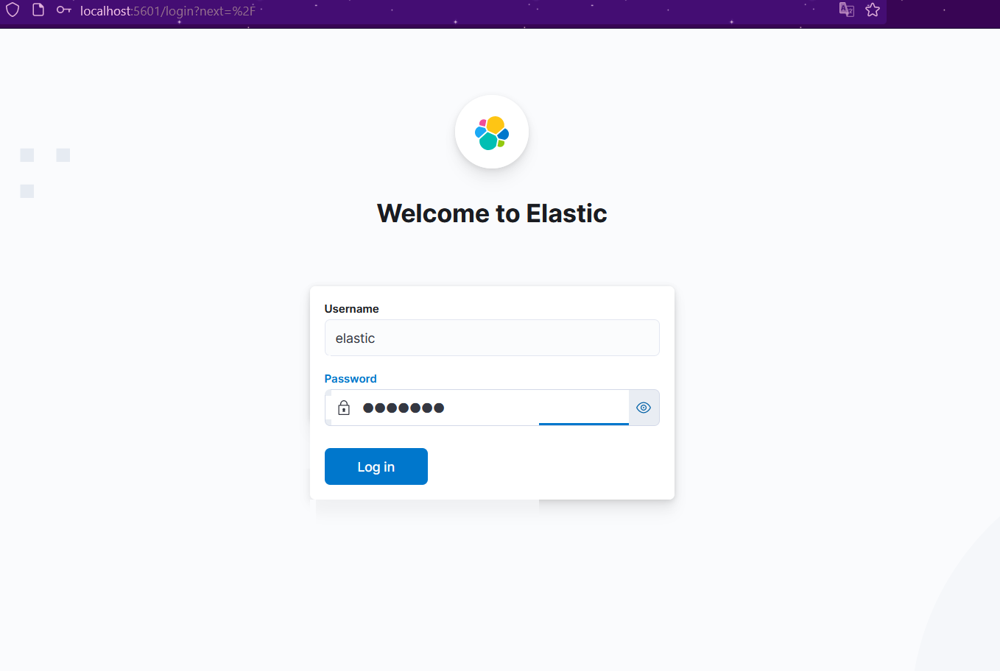
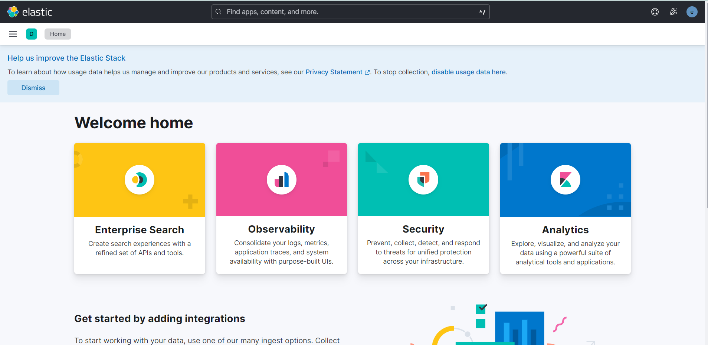
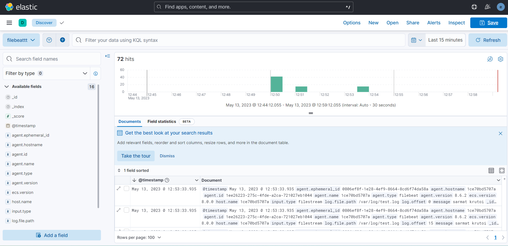

# Развертывание системы мониторинга ELK Stack (ElasticSearch)

Tyvan Maxim BISO-02-20

## Цель работы

1. Освоить базовые подходы централизованного сбора и накопления информации

2. Освоить современные инструменты развертывания контейнирозованных приложений

3. Закрепить знания о современных сетевых протоколах прикладного уровня

## Ход выолнения работы

### Шаг 1 - Предварительная конфигурация

Для работы ElasticSearch требуется увеличить размер виртуальной памяти системы:

    sudo sysctl -w vm.max_map_count=262144

Далее следует подготовить параметры окружения (файл .env):

ELASTIC_PASSWORD – пароль пользователя ‘gleboba’

KIBANA_PASSWORD – пароль пользователя ‘ikibanus’

STACK_VERSION – версия устанавливаемых образов ElasticSearch

CLUSTER_NAME – имя кластера

LICENSE – вид лицензии

ES_PORT – порт, который будет использоваться инстансами ElasticSearch

KIBANA_PORT – порт, который будет использоваться графической панелью
управления Kibana

MEM_LIMIT – максимум используемой памяти (в байтах)

### Шаг 2 - создание docker-compose.yml

Делаем сервис создающий сертификаты:

    setup:
        image: elasticsearch:${STACK_VERSION}
        volumes:
        - certs:/usr/share/elasticsearch/config/certs
        user: "0"
        command: >
        bash -c '
            if [ x${ELASTIC_PASSWORD} == x ]; then
            echo "Set the ELASTIC_PASSWORD environment variable in the .env file";
            exit 1;
            elif [ x${KIBANA_PASSWORD} == x ]; then
            echo "Set the KIBANA_PASSWORD environment variable in the .env file";
            exit 1;
            fi;
            if [ ! -f config/certs/ca.zip ]; then
            echo "Creating CA";
            bin/elasticsearch-certutil ca --silent --pem -out config/certs/ca.zip;
            unzip config/certs/ca.zip -d config/certs;
            fi;
            if [ ! -f config/certs/certs.zip ]; then
            echo "Creating certs";
            echo -ne \
            "instances:\n"\
            "  - name: es\n"\
            "    dns:\n"\
            "      - es\n"\
            "      - localhost\n"\
            "    ip:\n"\
            "      - 127.0.0.1\n"\
            "  - name: filebeat\n"\
            "    dns:\n"\
            "      - es\n"\
            "      - localhost\n"\
            "    ip:\n"\
            "      - 127.0.0.1\n"\
            "  - name: packetbeat\n"\
            "    dns:\n"\
            "      - es\n"\
            "      - localhost\n"\
            "    ip:\n"\
            "      - 127.0.0.1\n"\
            > config/certs/instances.yml;
            bin/elasticsearch-certutil cert --silent --pem -out config/certs/certs.zip --in config/certs/instances.yml --ca-cert config/certs/ca/ca.crt --ca-key config/certs/ca/ca.key;
            unzip config/certs/certs.zip -d config/certs;
            fi;
            echo "Setting file permissions"
            chown -R root:root config/certs;
            find . -type d -exec chmod 750 \{\} \;;
            find . -type f -exec chmod 640 \{\} \;;
            echo "Waiting for Elasticsearch availability";
            until curl -s --cacert config/certs/ca/ca.crt https://es:9200 | grep -q "missing authentication credentials"; do sleep 30; done;
            echo "Setting kibana_system password";
            until curl -s -X POST --cacert config/certs/ca/ca.crt -u "elastic:${ELASTIC_PASSWORD}" -H "Content-Type: application/json" https://es:9200/_security/user/kibana_system/_password -d "{\"password\":\"${KIBANA_PASSWORD}\"}" | grep -q "^{}"; do sleep 10; done;
            echo "All done!";
        '
        healthcheck:
        test: ["CMD-SHELL", "[ -f config/certs/es/es.crt ]"]
        interval: 1s
        timeout: 5s
        retries: 120

Данный сервис создаёт файл config/certs/instances.yml, где
прописывается, какие сертификаты нужны, и который передаётся в утилиту
`bin/elasticsearch-certutil`.

Далее создаем сервисы для Elasticsearch и Kibana:

    es:
        depends_on:
        setup:
            condition: service_healthy
        image: elasticsearch:${STACK_VERSION}
        volumes:
        - certs:/usr/share/elasticsearch/config/certs
        - esdata:/usr/share/elasticsearch/data
        ports:
        - ${ES_PORT}:9200
        environment:
        - node.name=es
        - cluster.name=${CLUSTER_NAME}
        - cluster.initial_master_nodes=es
        - ELASTIC_PASSWORD=${ELASTIC_PASSWORD}
        - bootstrap.memory_lock=true
        - xpack.security.enabled=true
        - xpack.security.http.ssl.enabled=true
        - xpack.security.http.ssl.key=certs/es/es.key
        - xpack.security.http.ssl.certificate=certs/es/es.crt
        - xpack.security.http.ssl.certificate_authorities=certs/ca/ca.crt
        - xpack.security.transport.ssl.enabled=true
        - xpack.security.transport.ssl.key=certs/es/es.key
        - xpack.security.transport.ssl.certificate=certs/es/es.crt
        - xpack.security.transport.ssl.certificate_authorities=certs/ca/ca.crt
        - xpack.security.transport.ssl.verification_mode=certificate
        - xpack.license.self_generated.type=${LICENSE}
        mem_limit: ${MEM_LIMIT}
        ulimits:
        memlock:
            soft: -1
            hard: -1
        healthcheck:
        test:
            [
            "CMD-SHELL",
            "curl -s --cacert config/certs/ca/ca.crt https://localhost:9200 | grep -q 'missing authentication credentials'",
            ]
        interval: 10s
        timeout: 10s
        retries: 120

    kibana:
        depends_on:
        es:
            condition: service_healthy
        image: elastic/kibana:${STACK_VERSION}
        volumes:
        - certs:/usr/share/kibana/config/certs
        - kibanadata:/usr/share/kibana/data
        ports:
        - ${KIBANA_PORT}:5601
        environment:
        - SERVERNAME=kibana
        - ELASTICSEARCH_HOSTS=https://es:9200
        - ELASTICSEARCH_USERNAME=kibana_system
        - ELASTICSEARCH_PASSWORD=${KIBANA_PASSWORD}
        - ELASTICSEARCH_SSL_CERTIFICATEAUTHORITIES=config/certs/ca/ca.crt
        mem_limit: ${MEM_LIMIT}
        healthcheck:
        test:
            [
            "CMD-SHELL",
            "curl -s -I http://localhost:5601 | grep -q 'HTTP/1.1 302 Found'",
            ]
        interval: 10s
        timeout: 10s
        retries: 120

## Шаг 4 - Установка и настройка средств сбора информации

Записываем сервис Filebeat:

    filebeat:
        depends_on:
        es:
            condition: service_healthy
        image: elastic/filebeat:${STACK_VERSION}
        container_name: filebeat
        volumes:
        - ./filebeat.yml:/usr/share/filebeat/filebeat.yml
        - ./logs/:/var/log/app_logs/
        - certs:/usr/share/elasticsearch/config/certs
        environment:
        - ELASTICSEARCH_HOSTS=https://es:9200
        - ELASTICSEARCH_USERNAME=elastic
        - ELASTICSEARCH_PASSWORD=${ELASTIC_PASSWORD}
        - ELASTICSEARCH_SSL_CERTIFICATEAUTHORITIES=config/certs/ca/ca.crt
И добавляем генерацию сертификата для Filebeat в сервис setup:

              echo -ne \
              "instances:\n"\
              "  - name: es\n"\
              "    dns:\n"\
              "      - es\n"\
              "      - localhost\n"\
              "    ip:\n"\
              "      - 127.0.0.1\n"\
              "  - name: filebeat\n"\
              "    dns:\n"\
              "      - es01\n"\
              "      - localhost\n"\
              "    ip:\n"\
              "      - 127.0.0.1\n"\
              > config/certs/instances.yml;

Файл конфигурации filebeat.yml:

    filebeat.inputs:
    - type: filestream
    id: sys-logs
    enabled: true
    paths:
        - /var/log/*

    output.elasticsearch:
    hosts: '${ELASTICSEARCH_HOSTS:elasticsearch:9200}'
    username: '${ELASTICSEARCH_USERNAME:}'
    password: '${ELASTICSEARCH_PASSWORD:}'
    ssl:
        certificate_authorities: "/usr/share/elasticsearch/config/certs/ca/ca.crt"
        certificate: "/usr/share/elasticsearch/config/certs/filebeat/filebeat.crt"
        key: "/usr/share/elasticsearch/config/certs/filebeat/filebeat.key"        

Сервис Packetbeat:

      packetbeat:
    depends_on:
      es:
        condition: service_healthy
    image: elastic/packetbeat:${STACK_VERSION}
    container_name: packetbeat
    user: root
    cap_add: ['NET_RAW', 'NET_ADMIN']
    volumes:
    - ./packetbeat.yml:/usr/share/packetbeat/packetbeat.yml
    - certs:/usr/share/elasticsearch/config/certs
    - /var/run/docker.sock:/var/run/docker.sock
    environment:
    - ELASTICSEARCH_HOSTS=https://es:9200
    - ELASTICSEARCH_USERNAME=elastic
    - ELASTICSEARCH_PASSWORD=${ELASTIC_PASSWORD}
    - ELASTICSEARCH_SSL_CERTIFICATEAUTHORITIES=config/certs/ca/ca.crt

Сервису нужно повысить привелегии для получения доступа к сети
контейнеров, за что отвечает параметр cap_add. Также необходимо
прописать доступ к сокету Docker – таким образом сбор сетевой трафика
будет проводиться по всем контейнерам.

Также, аналогично Filebeat, требуется отредактировать сервис для
добавления сертификатов.

Файл конфигурации packetbeat.yml:

    packetbeat.interfaces.device: any

    packetbeat.flows:
    timeout: 30s
    period: 10s

    packetbeat.protocols.http:
    ports: [80, 5601, 9200, 8080, 8081, 5000, 8002]

    processors:
    - add_cloud_metadata: ~

    output.elasticsearch:
    hosts: '${ELASTICSEARCH_HOSTS:elasticsearch:9200}'
    username: '${ELASTICSEARCH_USERNAME:}'
    password: '${ELASTICSEARCH_PASSWORD:}'
    ssl:
        certificate_authorities: "/usr/share/elasticsearch/config/certs/ca/ca.crt"
        certificate: "/usr/share/elasticsearch/config/certs/packetbeat/packetbeat.crt"
        key: "/usr/share/elasticsearch/config/certs/packetbeat/packetbeat.key"

## Шаг 5 - Запускаем сервисы

    docker-compose up -d
        [+] Running 5/5
        ✔ Container lab3-setup-1   Healthy                                                                                0.5s
        ✔ Container lab3-es-1      Healthy                                                                               31.6s
        ✔ Container filebeat       Started                                                                                2.7s
        ✔ Container lab3-kibana-1  Started                                                                                3.0s
        ✔ Container packetbeat     Started                                                                                2.9s

## Шаг 6 - Работа с ElasticSearch

Заходим на веб-ресурс`localhost:5601`, где нас встречает окно авторизации, где мы используем логин от elastic и пароль который мы задали в файле .env

Мы оказываемся на главной странице

Проверяем работоспособность packetbeat и filebeat c помощью команды `GET _cat/indices`

Создаем dataview для лог-файлов и сбора данных

Создаем dataview для трафика и получения статистики

## Вывод

В результате выполненной работы были развёрнута поисковая система ElasticSearch и прозведена настройка системы сбора трафика и логов. Были освоены приложения для работы с контейнеризацией приложений - Docker, Docker-compose и поисковая система ElasticSearch.